# Basic Shell Linux
Bash pada Terminal Linux berikut penjelasan nya :

## cd
cd (change directory) digunakan untuk berpindah dari satu direktori ke direktori lain, berikut contoh penggunaan nya :

- Menuju (navigasi) ke direktori home

 >cd

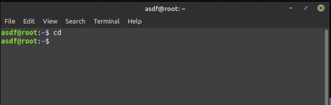

- Kembali ke satu level sebelumnya

 >cd ..

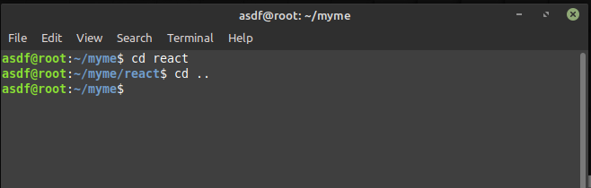

- Kembali ke dua level sebelumnnya

 >cd ../..

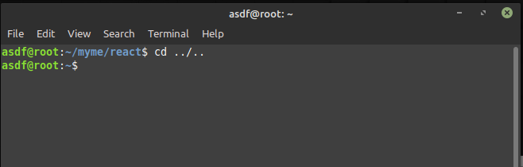

- Berpindah ke direktori sebelumnya

 >cd -

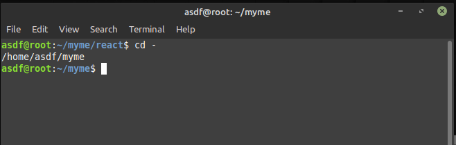

## ls
Menampilkan isi direktori

- Tampilkan isi file berdasarkan tanggal & waktu terbaru

 >ls -alht

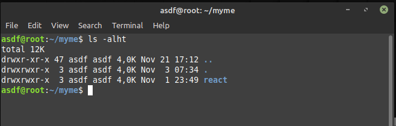

- Tampilkan hanya nama direktori/file

 >ls -l

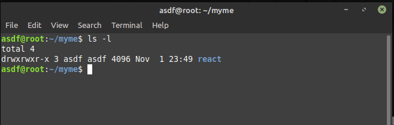

## mkdir
mkdir di gunakan untuk membuat folder atau direktori, berikut contoh penggunaan nya :

 >mkdir nama_folder

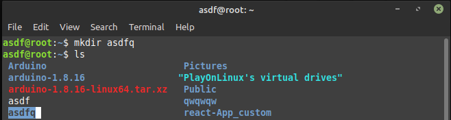

## mv
mv berfungsi untuk memindahkan file atau folder dari satu lokasi ke lokasi yg lain, berikut cara  penggunaan nya :

 >mv [nama_file] [tujuan]

fungsi mv juga bisa untuk merename file atau folder jika folder tidak tersedia maka otomatis akan merename nama file atau folder tsb

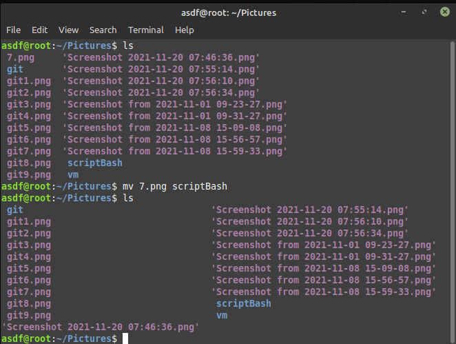

## cat
Gabungkan isi file dan tampilkan ke standar output, berikut cara penggunaan nya :

- Menampilkan isi file sengklek.txt dan teuing.txt pada layar

>cat sengklek.txt teuing.txt

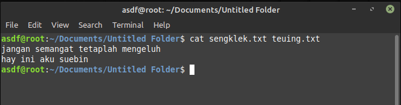

- Menampilkan informasi yang ada pada cpuinfo

>cat /proc/cpuinfo

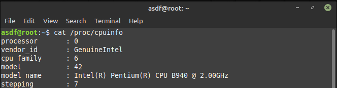

- Menampilkan isi dari "file1" dimulai dari baris pertama

>cat file1

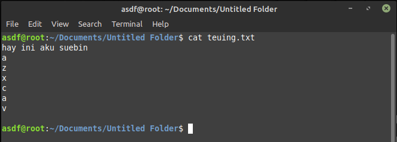

- Menampilkan isi dari "file1" dengan menambahkan nomor urut perbaris

>cat -n file1

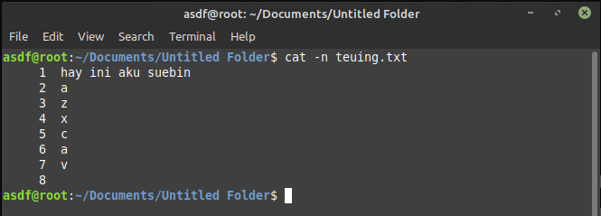

## cp
copy, Menyalin file. berikut cara penggunaan nya :

- Menyalin sebuah file

>cp file1 file2

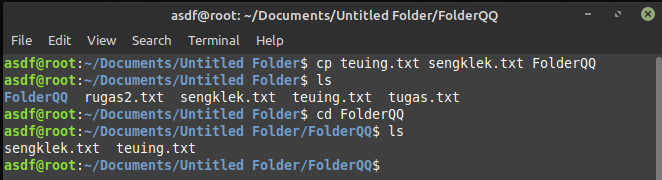

## cal
Menampilkan Kalender

- Menampilkan kalender tahun 2009

>cal 2003

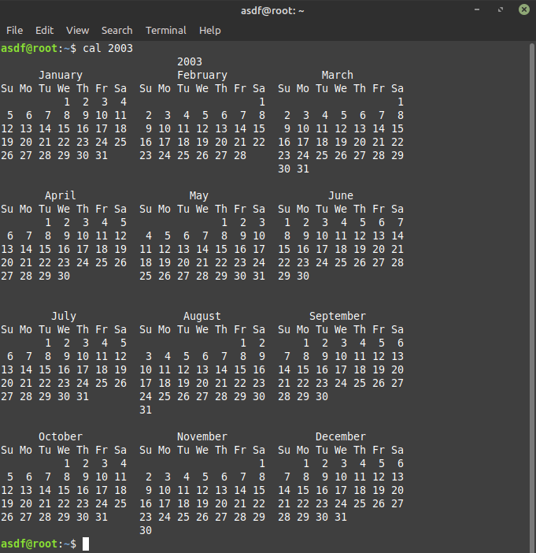

## touch
touch berfungsi untuk membuat file dan fungsi touch sangat membantu jika kita ingin membuat file tanpa GUI, berikut cara penggunaan nya :

 >touch nama_file

## rm
fungsi rm bisa digunakan untuk menghapus file atau folder, berikut cara penggunaan nya :

- rm nama_file / nama_folder

jika folder ada isi nya atau tidak kosong maka kita dapat tambahkan opsi -R :

- rm -R nama_folder

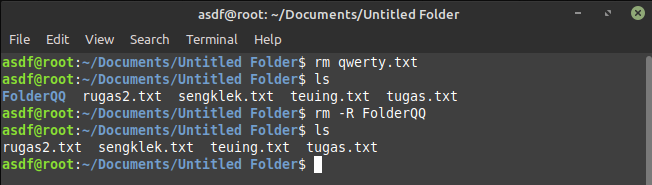

## find
Find adalah utilitas baris perintah yang memungkinkan untuk mencari file dan direktori dalam hirarki direktori, berikut cara penggunaan nya :

- Replace in files (Temukan semua file berekestensi .txt, kalau ketemu rubah semua kata "sakiem" di dalamnya menjadi kata "maemunah")

>find . -name "*.txt" -print | xargs sed -i 's/sakiem/maemunah/g'

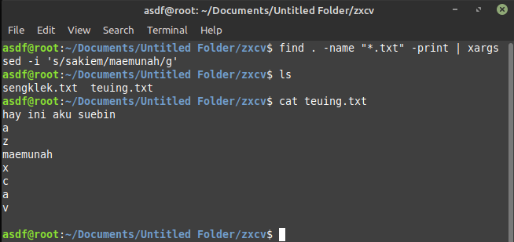

- Temukan file txt yang mengandung kata girl pada direktori /home/..

>find /home/.. -iname "*klek*.mp3"

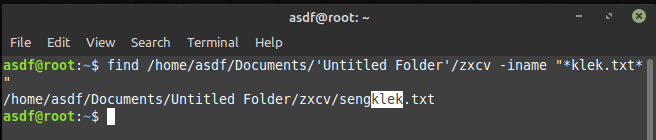

## grep
grep berfungsi untuk untuk mencari string (teks) dalam file. misal kita ingin menampilkan baris dari file.txt yg berisikan kalimat "curut" :

- Tampilkan semua file pada direktori /home/brain/Music yang isinya mengandung kata “cinta”

>grep -r "curut" /home/brain/Music

## sudo
Digunakan agar pengguna biasa dapat menjalakan perintah dengan security privilege milik pengguna lain (biasanya sebagai superuser/root).

- Sudo su merupakan salah satu perintah dalam sistem operasi linux yang hanya dapat dilakukan jika user memiliki akses root.

>sudo su

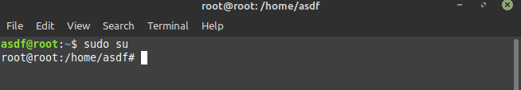

- Jalankan perintah terakhir sebagai root

> sudo !!

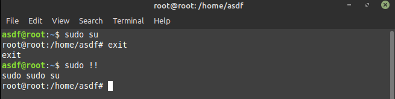

## df
Laporan penggunaan ruang harddisk.

>df -h

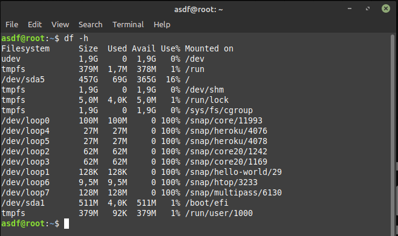

## ping
Memeriksa konektivitas jaringan dengan mengirimkan paket ICMP ke IP komputer tujuan.

- Periksa kontektivitas ke DNS Nawala

>ping 180.131.144.144

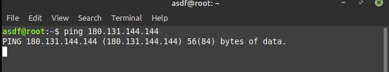

## wget
untuk mengunduh file dari web. Dengan Wget, Anda dapat mengunduh file menggunakan protokol HTTP, HTTPS, dan FTP. berikut cara penggunaan wget

>wget -bc http://kambing.ui.ac.id/videolan/vlc/1.1.9/vlc-1.1.9.tar.bz2

- opsi -bc (jalan di background, dan bisa dilanjutkan jika koneksi download terputus),
opsi ini berguna untuk mengunduh file dalam ukuran besar dan kita tidak punya banyak waktu untuk menunggunya hingga selesai.
Jadi tinggal saja semaleman, besok tinggal dipetikn :)

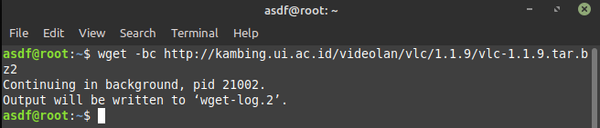

## kill
fungsi kill digunakan untuk mematikan service atau program yang sedang berajalan, berikut cara penggunaan nya

- Matikan proses pemakan sumber daya CPU terbesar

>Lihat_PID_yg_memakan_cpu_plg_besar-misalnya: 3111
$ top

>Kemudian kill id proses tersebut
$ kill 3111

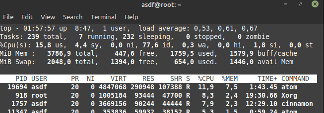

## chmod
Mengubah hak akses terhadap suatu file / direktori.

- Mengatur permission untuk akses baca (r), tulis (w) dan execute (x) oleh user owner (u) group (g) dan lain-lain (o) terhadap file1

>chmod ugo+rwx directory1

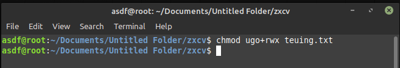

- Mengubah kepemilikan sebuah direktori dan semua file dan direktori di dalamnya

>chown -R user1 directory1

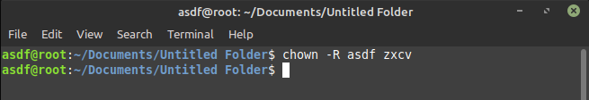
