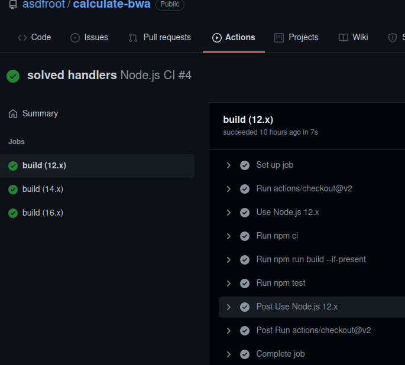

# Github action

## Step 1 - Create Workflows

- push App project pada revository baru

- setelah project dipush masuk ke menu Github action

**Action** >> **Set up this workflow** pada **Node.js**

**Start commit** >> **Commit new file**

## Step 2 – Check Running CI

- masuk Github Actions disitu akan terlihat workflow yang kita buat

- jika workflow yang kita buat berhasil maka akan ada tanda checklist warna hijau dengan begitu tandanya kita berhasil melakukan Continouse integrations menggunakan GitHub.

## Step 3 – Menguji Workflows

- buka code di handlersnya dan coba menyalahkan codinganya agar mendapat error

- misal merubah salah satu symbol **+** menjadi **-**

- save

- lalu commit dan push pada revository

 

 - check Github actionsya running jobs otomatis setelah dipush repository

 - Hasilnya pasti akan error

 - error tersebut adalah tanda bahwa code yang kita buat harus di check lagi sebelum di push , selain itu notif error akan terkirim ke email account github kita sebagai penanda bahwa kita harus melakukan fixing bug.

 - Fixing Bug

 
