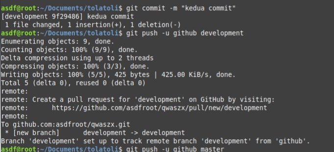

# Proses Study Case
Pada study case ini proses update dari branch **_development_** kemudian di update ke branch **_staging_** setelah itu di update ke **_production_** :

## Update development

- file yang akan diupdate

 >git add .

 >git commit -m "update develop"

 >git push -u github development

## Update staging

- pindah branch

 >git checkout staging

 - pastikan sudah berpindah Branch

 >git branch

 >git merge stagging development

 >git push -u github stagging

## Update production

- pindah branch

 >git checkout production

 - pastikan sudah berpindah Branch

 >git branch

 >git merge production stagging

 >git push -u github production

