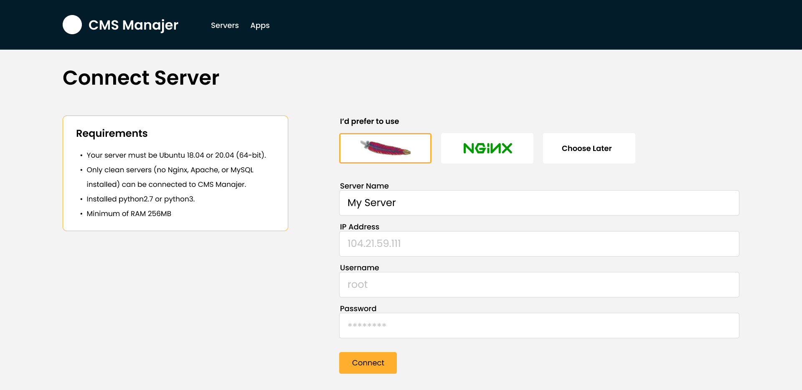

# CMS Manajer

  CMS Manajer (Cadabra Multiple Server Manajer) merupakan platform yang dibuat untuk memudahkan pengguna yang tidak memiliki pengetahuan server. CMS Manajer berguna untuk memanajemen server-server Kita dalam satu dashboard dan memudahkan Kita untuk menginstal aplikasi yang dibutuhkan dengan sekali klik serta dapat menginstal CMS (Content Management System) seperti WordPress. Selain itu CMS Manajer juga mengoptimalkan konfigurasi kernel, security dan performance pada server. :

## Cara Menghubugkan Server ke CMS Manajer

-   Pertama harus memiliki server yang menjalankan 64-bit Ubuntu 18.04 atau 20.04

-   Selanjutnya, di CMS Manajer, buka halaman Server dan klik Connect Server.

-   Masukkan alamat IP, nama pengguna dan kata sandi /SSH key Anda. Klik Connect.

-   CMS Manajer akan memeriksa koneksi dan mulai menginstal. mengatur firewall, kernel optimasi, dan banyak lagi.

-   Setelah instalasi selesai, server terhubung di CMS Manajer, dan akan diminta untuk menginstal aplikasi pertama  

## Instalasi Aplikasi

  Dengan CMS Manajer, Marketplace dapat menginstall apa yang butuhkan.

-   **Web Server**

    CMS Manajer memungkinkan untuk beralih dari Nginx atau Apache. Tetapi perlu menghapus semua aplikasi untuk mengganti server web lain.

-   **LEMP**

    LEMP (Linux, Nginx, MySQL, PHP)

-   **LAMP**

    LAMP (Linux, Apache, MySQL, PHP)

-   **WordPress**

    Dapat menginstal WordPress dengan sekali klik, hanya perlu memberikan judul, nama pengguna, kata sandi untuk menginstalnya.

-   **And more**

    cms manajer mendukung untuk menginstal MongoDB dan Docker

## Instalasi WordPress

-   Langkah pertama: Buat Aplikasi di CMS Manajer

    Di CMS Manajer, klik **Create App**; dapat dilakukan setelah menghubungkan server atau dengan membuka halaman Aplikasi.

    Beri nama aplikasi dan masukkan domain situs jika ada. juga dapat memilih pengguna sistem yang inginkan untuk menjalankan aplikasi ini.

-   Langkah kedua: Instal One-Click

> Sekarang, beri tanda centang di sebelah WordPress; akan muncul formulir baru.
>
> Masukkan judul situs, nama pengguna administrator, kata sandi, dan alamat email untuk konfirmasi penyiapan. Nama pengguna dan sandi administrator tidak sama dengan pengguna sistem aplikasi.
>
> klik Create App untuk mengirimkan formulir. akan diperlihatkan beberapa detail tentang aplikasi.

-   Langkah ketiga: Review Database

> Installer WordPress satu-klik CMS Manajer secara otomatis menghasilkan nama database MySQL, nama pengguna, dan kata sandi. dapat dilihat di CMS Manajer.
>
> Buka aplikasi di CMS Manajer dan buka tab Database.akan melihat nama database dan nama pengguna.  

## Cara Mengatur SSL di Situs dengan CloudFlare

  Dukungan CMS Manajer untuk mengatur SSL dengan CloudFlare. kemudian dapat mengaktifkan pengalihan ke HTTPS. :

-   Langkah pertama : Daftar ke CloudFlare

> Sebelum kita mulai, harus mendaftar ke CloudFlare dan tambahkan domain pada dasbor.

-   Langkah kedua : Domain

> Di menu DNS, cukup tambahkan catatan A. Silakan masukkan subdomain sesuai dengan pengaturan di CMS Manager.

**Name** : your subdomain

**IPv4 address** : your server IP

**Proxy status** : redirect to HTTPS

> Sekarang kita dapat mengakses situs web dengan HTTPS seperti ini

