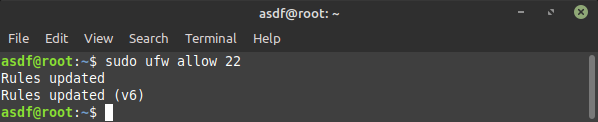

# Manage Server with Terminal

## Texs Editor

  Nano merupakan sebuah aplikasi editor berbasis teks untuk Unix dan sistem Unix-like. :

-   nano

    `nano nanotes.txt` membuka file nanotes.txt dengan teks editor nano

    

    `nano /directory/directory1/nanotes.txt` membuka file nanotes.txt yang lokasinya berada dalam folder

    

-   Shortcut pada text editor nano

    `CTRL + X` untuk keluar dari editor. setelah keluar akan dimintai perubahan, perubahan akan disimpan atau tidak. jika `Y` untuk **Yes** dan `N` untuk **No**.

    `CTRL + O` untuk menyimpan tanpa menutup nanu. lalu **Enter**

    `CTRL + W` untuk mencari teks, kemudian masukan pada kolom pencarian lalu **Enter**

    `ALT + A` untuk melihat teks. arahkan cursor pada teks yang diinginkan.

    `ALT + 6` digunakan untuk _copy_ teks yang sudah di _select_

    `CTRL + K` digunakan untuk _cut_ teks yang sudah di _select_

    `CTRL + U` digunakan untuk _paste_ teks yang sudah di _copy_

    `CTRL + A` untuk pindah cursor ke baris paling awal

    `CTRL + E` untuk pindah cursor ke baris paling akhir

    

## Text Manipulation

    Text Manipulation menggunakan terminal tanpa nano, berikut perintah yang dapat digunakan :

-   cat

    `cat file.md` digunakan untuk melihat isi file

    `cat > file1.md` untuk membuat file baru dan memasukan teks

    `cat file1.md file2.md > file3.md` untuk menggabungkan dua file dan menyimpannya pada file3.md

    

-   sed

    `sed -i 's/dalam/jero/g' file3.md`

    > keterangan : akan mengganti semua kata "dalam" menjadi "jero" pada file3.md

    

-   grep

    `grep file file3.md` akan mencari kata "file" pada file3.md

    

    `grep -c jero file3.md` akan menghitung jumlah kata "jero" pada file3.md

    

    `grep isi *` akan mencari semua kata yang berisi kata "isi"

    

-   sort

    `sort file3.md` mengurutkan berdasarkan ascending

    

    `sort -r file3.md` mengurutkan berdasarkan descending

    

-   echo

    `echo "Hello Google"` mencetak kata **hey kamu**

    

    `echo "ini data di file3" >> file3.md` menambahkan **ini data di file3** pada file3.md

    

    `echo "isi file terganti semua" > file3.md` mengganti semua isi file3 menjadi **isi file terganti semua**

    

-   less

    `less /proc/cpuinfo` menampilkan isi file atau output "cpuinfo" dalam satu halaman sekaligus

    

-   head

    `head /proc/cpuinfo` akan menampilkan 10 baris pertama

    

-   tail

    `tail /proc/cpuinfo` menampilkan 10 baris terakhir dari cpuinfo

    `tail -n 5 /proc/cpuinfo` menampilkan 5 baris terakhir dari cpuinfo

    

## Monitoring

    melihat kinerja aktivitas sistem secara realtime. berikut perintah untuk memonitoring sebuah server :

-   htop

     `htop` melihat penggunaan memory, cpu, dan swap

    

-   nmon

    `nmon`

    > **C** untuk menampilkan cpu
    >
    > **D** untuk menampilkan disk

    

-   lsof

    `lsof` menampilkan seluruh proses

    

    `lsof -u asdf` menampilkan proses yang dilakukan oleh user "asdf"

    

    `lsof -i :80` menampilkan proses yang menggunakan port 80

    

-   ps

    `ps -f -u asdf` menampilkan proses pada user "asdf"

    

    `ps -aux` menampilkan proses secara lengkap

    

## Network Firewall

   Network Firewall digunakan untuk mengamankan sebuah serveer. tools yang digunakan :

   `sudo ufw default deny incoming` memblokir semua akses yang masuk

   

   `sudo ufw default allow outgoing` membuka semua akses yang keluar

   

   `sudo ufw app list` menampilkan aplikasi yang didukung oleh ufw pada Server

   

   `sudo ufw allow "Nginx full"` mengijinkan akses dari luar ke dalam untuk aplikasi nginx

   

   `sudo ufw allow 22` membuka akses untuk port  22

   

   `sudo ufw allow 22/tcp` membuka akses untuk port 22 dengan koneksi tcp

   

   `sudo ufw allow 22/udp` membuka akses untuk port 22 dengan koneksi udp

   

   `sudo ufw deny 80` memblokir semua akses ke port 80

   

   `sudo ufw delete deny 80` menghapus konfigurasi, perintah harus sama dengan yang ingin dihapus

   
