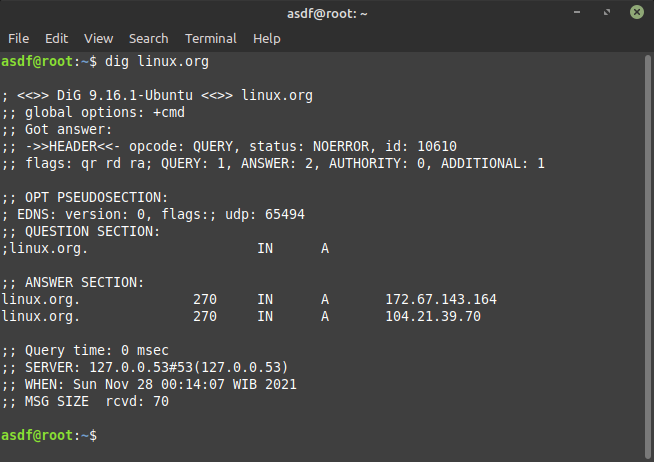

# Tambahan Perintah Server Terminal

-   awk

    `awk ' { print $0 }' file3.md` Mencetak Setiap Baris Kata Dalam Sebuah File

    `awk ' { print $1,$4 }' file3.md` Mencetak Kolom ke-n dengan Karakter Tertentu

-   cut

    `cut -c 7 file3.md` Menampilkan 1 karakter untuk semua baris tulisan dari file3.md

    `cut -c 1-17 file3.md` Menampilkan 1 sampai 17 karakter untuk semua baris tulisan dari file3.md

-   dig

    `dig linux.org` Mencetak informasi tentang domain linux.org

-   fmt

    `fmt file3.md` memformat ulang teks yang sudah dibuat sebelumnya

    `fmt -t file3.md` Digunakan untuk membuat isi teks menjadi paragraf

-   traceroute

    `traceroute dumbways.id` Menunjukkan rute yang dilewati paket untuk mencapai tujuan

-   uniq

    `uniq file3.md` Menghilangkan baris – baris berurutan yang mengalami duplikasi

