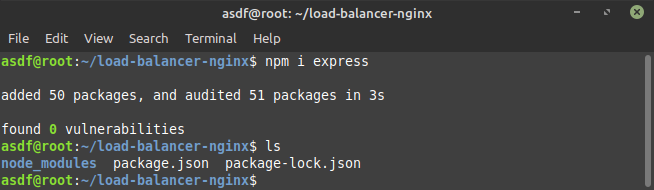
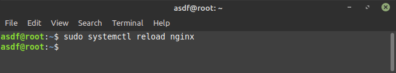

# Load Balancing

  Load Balancing adalah sebuah mekanisme untuk membagi atau mendistribusikan trafik ke beberapa server. Nginx selain berfungsi sebagai web server bisa juga berfungsi sebagai load balancer.

## Metode Load Balancing

-   Round Robin: mendistribusikan trafik ke setiap server secara bergantian.

-   Least Connections: mendistribusikan trafik ke server yang paling sedikit koneksi aktifnya.

-   IP Hash: mendistribusikan trafik ke server yang sama ketika visitor pertama kali melakukan request.

    

## Load Balancing metode Round Robin dengan Nginx

-   Membuat file node.js

    `mkdir load-balancer-nginx` Membuat folder

    

    `cd load-balancer-nginx` Pindah directory yang telah dibuat

    `npm init -y` Membuat file package.json

    

    `npm i express` Menginstal express

    

    `sudo nano index.js` Membuat aplikasi dengan format js

    

        const express = require("express");
        const app = express();
        const PORT = process.env.PORT;
        if (!PORT) {
              throw new Error("PORT variable not defined");
        }
        app.get("/", (req, res) => {
              const data = `App running at PORT ${PORT}`;
              return res.send(data);
        });
        app.listen(PORT, "0.0.0.0", () => console.log(`Server at ${PORT}`));

    

    `export PORT=1212;` Mendefinisikan aplikasi 1 berjalan pada port 1212

    

    `node index.js` Menjalankan aplikasi 1

    

    `export PORT=1313;` Mendefinisikan aplikasi 2 berjalan pada port 1313

    

    `node index.js` Menjalankan aplikasi 2

    

    `cd /etc/nginx` Membuka directory nginx

    `sudo nano nginx.conf` Memasukan config

    

         http {
                upstream backend {
                        server 127.0.0.1:1212;
                        server 127.0.0.1:1313;
                }
                server {
                        listen 80;
                        root /home/asdf/load-balancer-nginx/;
                        location / {
                          proxy_pass <http://backend>;
      		              }
      	         }
          }
          events { }

    

    `nginx -s reload` Memuat ulang konfigurasi nginx

    

    Masukan `127.0.0.1` pada _url_ _**Web Browser**_ dan lakukan _Reload Current Page_ atau `CTRL+R` pada _**Web Browser**_, maka secara bergantian menampilkan halaman dari 1212 dan 1313

    

    
