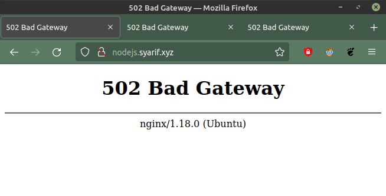
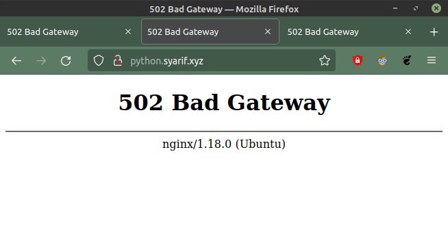
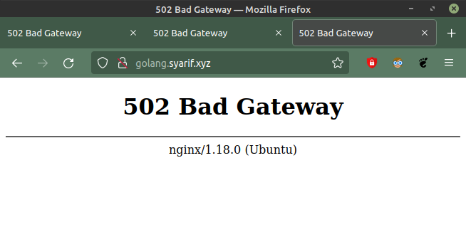
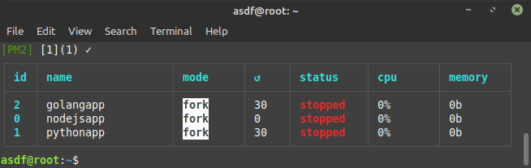
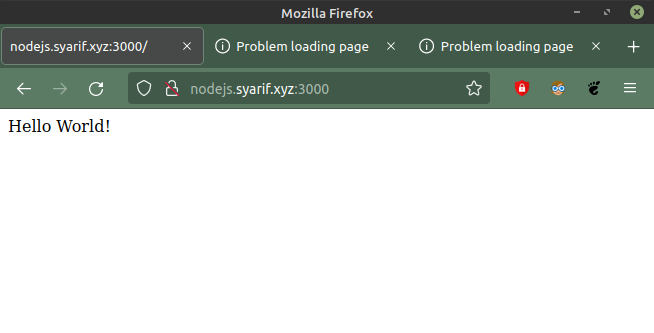
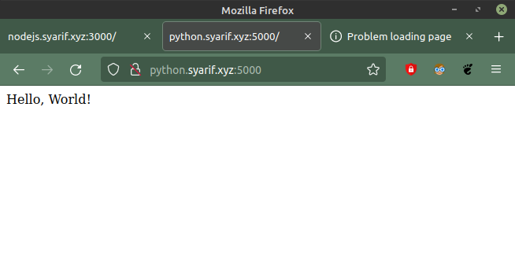
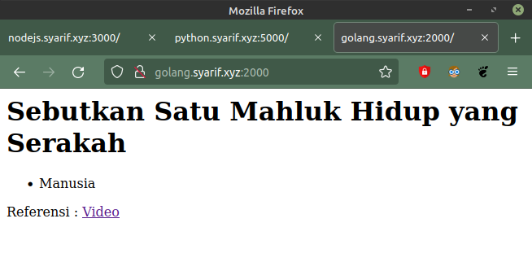
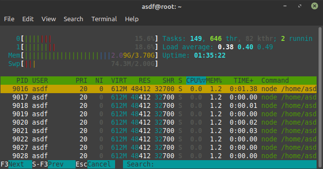
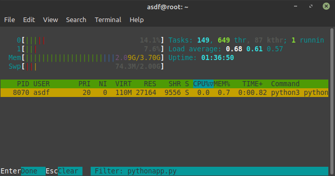
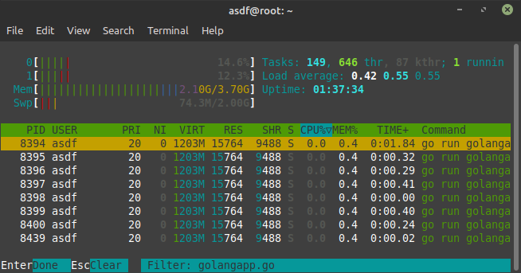

# Monitoring

## Monitoring App

-   Case ketika aplikasi mati

    `nodejs.nama.xyz` masukan domain pada **_Web Browser_**

    

    `python.nama.xyz` masukan domain pada **_Web Browser_**

    

    `golang.nama.xyz` masukan domain pada **_Web Browser_**

    

    Memeriksa Aplikasi menggunakan pm2 dengan perintah `pm2 list`

    

-   Case ketika aplikasi berjalan

    `nodejs.nama.xyz` masukan domain pada **_Web Browser_**

    

    `python.nama.xyz` masukan domain pada **_Web Browser_**

    

    `golang.nama.xyz` masukan domain pada **_Web Browser_**

    

    Memeriksa Aplikasi bisa menggunakan pm2 `pm2 list` atau dengan perintah `htop` pada terminal

    

        

        
