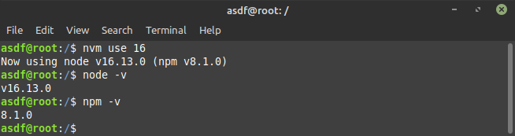
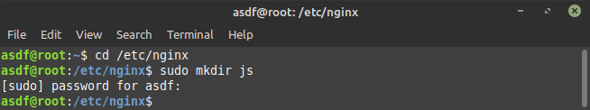
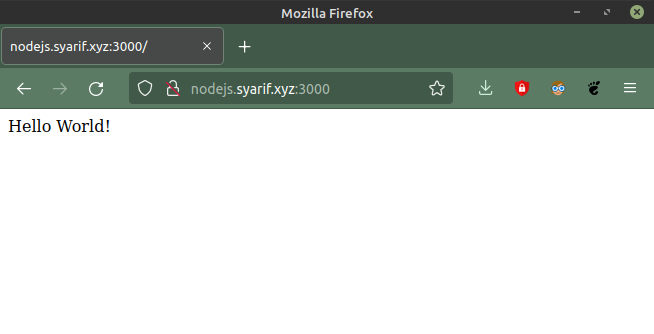

# Pembuatan Aplikasi

## Instalasi Node.js

   Aplikasi yang dibuat oleh javascript (node.js) maka perlu instal node.js

   `curl -o- https://raw.githubusercontent.com/creationix/nvm/v0.38.0/install.sh|bash`

   `nvm install 16.13.0`
   
   

   `nvm use 16`

   

   Jika instalasi node.js sudah berhasil, untuk mengeceknya gunakan perintah :

   `node -v`
   
   `npm -v`

   

-   Membuat example app Node.js :

   `mkdir myapp-nodejs` Membuat folder baru dengan nama myapp-nodejs

   `cd myapp-nodejs` Pindah directory ke myapp-nodejs

   

   `npm init -y` Membuat file package.json

   

   `npm install express` Menginstal express

   

   `nano index.js` Membuat file dengan index.js

   

      const express = require('express')
      const app = express()
      const port = 3000
      app.get('/', (req, res) {
        res.send('Hello World!')
      })
      app.listen(port, () => {
        console.log('Example app listening at http://localhost:${port}')
      })

       

   `CTRL+X` untuk keluar dan `y` untuk menyimpan dan yang terakhir tekan `Enter`

   `node index.js` Untuk menjalankan aplikasi

   

   Masukan `http://localhost:3000` pada _url_ _**Web Browser**_

   

## Instalasi Python

   Aplikasi yang dibuat dengan Python maka perlu instal Python

   `sudo apt update` Update sistem

   

   `sudo apt upgrade -y` Upgrade sistem

   

   `python3 -V` Biasanya Python sudah ada secara default

   

   `sudo apt install python3-pip` Instalasi package manager

   

   `pip install flask` Instalsi flask

   

-   Membuat example app Python :

   `mkdir python` Membuat sebuah folder

   

   `nano index.py` Membuat file index.py

   

      from flask import Flask
      app = Flask(__name__)
      @app.route("/")
      def hello_world():
          return "
Hello, World!
"
      if __name__=="__main__":
          app.run()

   

   `python3 index.py` Menjalankan aplikasi

   

   Masukan `http://localhost:5000` pada _url_ _**Web Browser**_

   

## Instalasi Golang

   Aplikasi yang dibuat dengan Golang maka perlu instal Golang

   `wget https://go.dev/dl/go1.17.3.linux-amd64.tar.gz` Download Golang

   

   `sudo tar -C /usr/local -xzf go1.17.3.linux-amd64.tar.gz` Upgrade sistem

   

   `nano .bashrc` Memasukan path go pada bashrc

   

   Dipaling bawah file **.bashrc** isi path go `export PATH=$PATH:/usr/local/go/bin`

   

   `go version` Verifikasi instalasi

   

   `mkdir golang` Membuat directory golang

   `cd golang` Pindah directory

   

   `nano index.go` Membuat sebuah file index.go

   

      package main
      import (
    	        "fmt"
    	        "log"
    	        "net/http"
      )
      const port string = "2000"
      func welcome(w http.ResponseWriter, r *http.Request) {
    	      dataHTML := `<h1>Sebutkan Satu Mahluk Hidup yang Serakah</h1>
    		      <ul>
    			       <li>Manusia</li>
    		      </ul>
    		      Referensi : <a href="https://youtu.be/Q_WHGV5bejk">Video</a>`
    	      if r.Method == "GET" {
    		        fmt.Fprintf(w, dataHTML)
    	      }
      }
      func main() {
    	      fmt.Println("Berjalan di Port :", port)
    	      http.HandleFunc("/", welcome)
    	      if err := http.ListenAndServe(":"+port, nil); err != nil {
    		        log.Fatal(err)
    	      }
      }

   

   Masukan `http://localhost:2000` pada _url_ _**Web Browser**_

   
