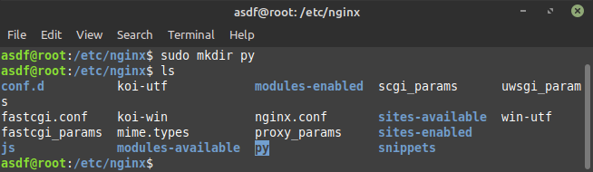

# Reverse Proxy

  Reverse proxy digunakan untuk mengamankan server dari serangan malware, dengan menggunakan reverse proxy, user tidak bisa langsung mengakses aplikasi secara langsung, sehingga harus melewati web server (nginx) sebagai jembatan. Untuk menggunakan reverse proxy pada nginx, berikut langkah yang akan kita lakukan :

## Reverse Proxy App node.js

    `cd /etc/nginx`

    `sudo mkdir js`

    

    `sudo nano /etc/nginx/nginx.conf`

    

    `sudo nano js.reverse-proxy.conf`

    

    

    `sudo nano /etc/hosts`

    

    `sudo nginx -t`

    

    `sudo systemctl reload nginx`

    

    Masukan `nodejs.syarif.xyz` pada _url_ _**Web Browser**_

    

## Reverse Proxy App Python

    `cd /etc/nginx`

    `sudo mkdir py`

    

    `sudo nano /etc/nginx/nginx.conf`

    

        

    `sudo nano py.reverse-proxy.conf`

    

    

    `sudo nano /etc/hosts`

    

    `sudo nginx -t`

    

    `sudo systemctl reload nginx`

    

    Masukan `python.syarif.xyz` pada _url_ _**Web Browser**_

    

## Reverse Proxy App Golang

    `cd /etc/nginx`

    `sudo mkdir go`

    

    `sudo nano /etc/nginx/nginx.conf`

    

    `cd go.reverse-proxy.conf`

    `sudo nano go.reverse-proxy.conf`

    

    

    `sudo nano /etc/hosts`

    

    `sudo nginx -t`

    

    `sudo systemctl reload nginx`

    

    Masukan `nodejs.syarif.xyz` pada _url_ _**Web Browser**_

    
